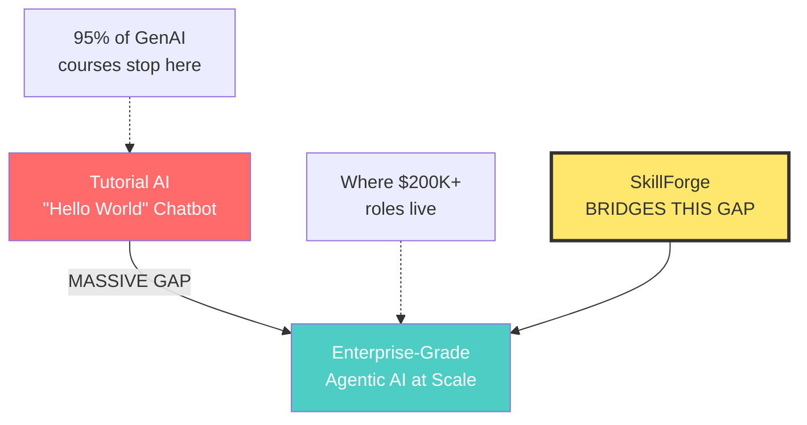

# SkillForge — Multi-Million ARR Strategic Blueprint

> **From Expert Flashcards to an AI-Native Upskilling Platform**
> *Strategic Analysis for Dhamodharan Sankaran, Principal Architect*

---

## 1. Content Asset Audit — What You Already Have

Your two flashcard datasets represent an **extraordinary competitive moat** that most EdTech startups spend years (and millions) trying to build. Let me break down exactly what sits in your vault:

### AI/GenAI Command Center (`ai_genai_interview_dashboard.jsx`)

| Domain | Cards | Depth | Uniqueness |
|--------|-------|-------|------------|
| ⚡ Transformer Fundamentals | 5 | Architecture-level (MoE, GQA, RoPE, MoE routing) | High — goes beyond tutorials |
| 🎯 Prompt Engineering | 5 | Production patterns (Prompt-as-Code, CoT, ReAct) | **Very High** — enterprise patterns |
| 📚 RAG Architecture | 5 | Full pipeline (chunking → reranking → evaluation) | **Very High** — production-grade |
| 🤖 AI Agents & MCP/A2A | 10 | Enterprise agentic patterns, MCP servers, A2A protocol | **Exceptionally High** — bleeding edge |
| 📈 AgentOps | 2 | Full dashboard design with healthcare case study | **Unique** — rare production content |
| 🔧 Fine-Tuning & LoRA | 3 | LoRA/QLoRA/DPO/RLHF decision frameworks | High |
| 📐 Vector DBs & Embeddings | 2 | HNSW/IVF/DiskANN + embedding fine-tuning | High |
| 🕸️ Knowledge Graphs | 1 | GraphRAG + hybrid KG approaches | High |
| 📊 Evaluation & Benchmarks | 4 | AI lifecycle paradigm shift, eval frameworks | **Very High** |
| 🛡️ Security & Guardrails | 8 | Model Armor, NHI Zero Trust, 5 Imperatives, AI Security Playbook | **Exceptionally High** |
| ⛓️ LangChain & LangGraph | 2 | Full ecosystem (LangSmith, checkpointing, HITL) | High |
| 🚀 MLOps & Serving | 5 | vLLM, AWS stack, LLMOps pipeline, model lifecycle | **Very High** |
| ☁️ Vertex AI & Cloud | 1 | GCP AI stack | Medium |
| 🔨 Context & Harness Eng. | 6 | Anthropic patterns, graduated compression, agent skills, multi-agent | **Exceptionally High** |
| 🔷 Google ADK | 2 | ADK architecture, agent memory, Vertex Memory Bank | **Very High** |
| 🏗️ AI System Design & Leadership | 5 | 7-layer reference architecture, ADRs, AI governance, system design interview framework | **Exceptionally High** |

**Total: ~66 deep flashcards across 16 domains** — each with Q&A, enterprise experience, quiz, and production case studies.

### Architecture Mastery (`chase_interview_flashcards.jsx`)

| Domain | Cards | Key Topics |
|--------|-------|------------|
| 🏛️ Architectural Patterns | 12 | Event Sourcing, CQRS, DDD, Strangler Fig, BFF, Hexagonal, CAP/PACELC, 12-Factor, TOGAF |
| 💾 Data Access & Structure | 11 | Materialized Views, CDC, Sharding, Kafka Deep-Dive, Schema Registry, Stream Processing, DB selection matrix |
| ⚙️ Microservices & Resilience | 10 | Saga, Circuit Breaker, Bulkhead, Sidecar, Service Mesh/Istio, Rate Limiting, Feature Flags, Spring Boot |
| 🎨 GoF Design Patterns | 8 | Singleton, Factory, Builder, Strategy, Observer, Adapter/Facade/Proxy, Decorator, Chain of Responsibility |
| 🔐 API & Security | 18 | OAuth 2.0, JWT, mTLS, Zero Trust, OWASP, API Versioning, PCI-DSS, WAF, DDoS, Apigee/Kong, Secrets Management |
| 🤖 AI/LLM/Agentic | 12 | RAG, Agentic AI, Multi-Agent, MCP, A2A, LLM Orchestration, Prompt Engineering, Guardrails, SHAP/LIME, MLOps |
| ☁️ Cloud & DevOps | 14 | K8s, Deployment strategies, Terraform, Observability, CI/CD, Performance Engineering, Caching, Load Balancing, SRE, Chaos Engineering |
| 📦 Containers & Orchestration | 7 | Docker, Networking, Security, K8s vs Swarm, OpenShift, Advanced K8s, Image Optimization |
| 🔒 Protocols & Encryption | 8 | TLS/mTLS, Symmetric/Asymmetric, PKI, HTTP/2/3, gRPC/REST/GraphQL, WebSocket/SSE, Message Protocols |
| ☁️ Cloud Strategy (MD Round) | 6 | Well-Architected Framework, Multi-Region, Data Mesh, Platform Engineering |
| 🔐 OAuth & Identity | 5 | OAuth deep-dive, OIDC, SAML, Token Exchange, FIDO2/Passkeys |

**Total: ~111 flashcards across 11 domains** — covering the full product development lifecycle from architecture to production.

---

### 🎯 The "Secret Sauce" in Your Content

What makes this content **irreplaceable** is NOT the technical knowledge (anyone can compile Transformer facts). It's the **"How I Used This at Citi"** sections. These contain:

1. **Real production numbers**: "$3.2M annual savings", "50K requests/day", "99.7% uptime"
2. **Specific architectural decisions**: "ADR-007: pgvector over Pinecone — data residency requirement"
3. **Failure stories**: "Agent with overprivileged DB access ran unintended UPDATE on 1,200 trade records"
4. **Team structures**: "5 ML Engineers + 12 AI Engineers + 4 Platform Engineers = 21 people"
5. **Cost breakdowns**: "$180K/month optimized from $310K/month (42% reduction)"

**This is the content moat.** No AI-generated course, no Udemy instructor, no bootcamp can compete with battle-tested enterprise experience backed by specific metrics.

---

## 2. Market Positioning — The "Expert-in-the-Loop" Advantage

### The Problem You're Solving



### Competitive Landscape

| Competitor | Approach | Weakness SkillForge Exploits |
|-----------|----------|------------------------------|
| **Coursera/Udemy** | Passive video lectures | No production context, no enterprise patterns, no "what actually breaks" |
| **DeepLearning.AI** | Academic fundamentals | Stops at theory — doesn't cover MCP, A2A, AgentOps, enterprise security |
| **Replit/Codecademy** | Code-along tutorials | Toy examples, not enterprise-grade multi-agent systems |
| **O'Reilly** | Books/videos | Broad but shallow, no personalized learning path |
| **Internal Corporate Training** | Company-specific | Expensive ($5K-20K per seat), slow to update, not portable |
| **SkillForge** | **Expert-curated, experience-anchored, agentic-driven** | **Production patterns + real metrics + interactive simulations + adaptive learning** |

### Your Unique Positioning

> **"SkillForge is what happens when a Principal Architect who built 47 production AI agents at a Fortune 100 bank turns their battle-tested playbook into an interactive learning system."**

You're not selling courses. You're selling **the 10,000 hours** compressed into a structured, adaptive system.

---

## 3. Revenue Model — Path to Multi-Million ARR

### Tiered Pricing Strategy

```
┌─────────────────────────────────────────────────────┐
│ TIER 1: FORGE FREE                     $0/month     │
│ • 20 flashcards (teaser content)                    │
│ • Basic quiz mode                                   │
│ • Community access                                  │
│ • Goal: Top-of-funnel, brand building               │
├─────────────────────────────────────────────────────┤
│ TIER 2: FORGE PRO                     $49/month     │
│ • Full 177+ card library                            │
│ • AI-powered adaptive learning paths                │
│ • Interactive system design playground              │
│ • Progress tracking + skill gap analysis            │
│ • Weekly "Architect's Briefing" newsletter           │
│ Goal: Individual contributor upsell                 │
├─────────────────────────────────────────────────────┤
│ TIER 3: FORGE ENTERPRISE        $299/user/month     │
│ • Everything in Pro                                 │
│ • Custom content for your tech stack                │
│ • Agentic Workflow Simulator (hands-on labs)        │
│ • Team dashboards + manager reporting               │
│ • SSO/SAML integration                              │
│ • Dedicated onboarding + content customization      │
│ • Compliance-ready (SOC2 audit trail)               │
│ Goal: B2B enterprise contracts                      │
├─────────────────────────────────────────────────────┤
│ TIER 4: FORGE ARCHITECT          $999/seat/month    │
│ • Everything in Enterprise                          │
│ • 1:1 monthly office hours with you                 │
│ • Architecture review sessions                      │
│ • Custom ADR templates + governance frameworks      │
│ • Priority access to new content                     │
│ Goal: High-touch, high-value advisory               │
└─────────────────────────────────────────────────────┘
```

### Revenue Projections (Conservative)

| Milestone | Timeline | Users | MRR | ARR |
|-----------|----------|-------|-----|-----|
| **Launch** | Month 0-3 | 200 Pro, 0 Enterprise | $9,800 | $118K |
| **Traction** | Month 4-8 | 800 Pro, 2 Enterprise (20 seats each) | $51,200 | $614K |
| **Growth** | Month 9-14 | 2,000 Pro, 8 Enterprise (30 seats avg) | $169,800 | $2.04M |
| **Scale** | Month 15-24 | 5,000 Pro, 25 Enterprise (50 seats avg) | $619,000 | $7.4M |

> [!IMPORTANT]
> The **enterprise tier is where the real money lives**. A single 100-seat enterprise deal at $299/user = $29,900 MRR = $358K ARR. Just **10 enterprise customers** gets you to **$3.6M ARR**.

---

## 4. Product Roadmap — 3 Phases

### Phase 1: MVP — "The Forge" (Month 1-3)

**Goal**: Turn your existing flashcards into a premium, adaptive learning experience

| Feature | Description | Technical Approach |
|---------|-------------|-------------------|
| Adaptive Flashcard Engine | Spaced repetition + difficulty adaptation | SM-2 algorithm + LLM-powered difficulty assessment |
| Interactive Quiz System | Multi-format quizzes with explanations | Already built — enhance with adaptive sequencing |
| "Citi Experience" Toggle | Expert insights with real metrics | Already built — gate behind Pro tier |
| Skill Gap Analysis | Assessment that maps knowledge gaps | RAG over your card content + scoring rubric |
| Learning Path Generator | Personalized study plans | LangGraph agent that sequences cards based on goals |
| Progress Dashboard | Visual mastery tracking | Extend existing React dashboard |

**MVP Tech Stack:**
- Frontend: React (extend existing dashboard) + Vite
- Backend: FastAPI (Python) or Next.js API routes
- Database: PostgreSQL + pgvector (you know this stack)
- Auth: Clerk or Auth0
- LLM: Claude via Bedrock (your production stack)
- Hosting: Vercel (frontend) + AWS (backend)

---

### Phase 2: Growth — "The Simulator" (Month 4-8)

**Goal**: Build interactive, hands-on learning experiences that no competitor offers

| Feature | Description | Why It's a Moat |
|---------|-------------|-----------------|
| **Prompt-as-Code Playground** | Write, test, version prompts in a sandbox | Based on your production prompt versioning pattern |
| **RAG Pipeline Builder** | Visual drag-drop RAG pipeline construction | Teaches chunking, embedding, retrieval hands-on |
| **Agent Workflow Simulator** | Simulate ReAct, Plan-and-Execute, LangGraph flows | Based on your 47-agent production architecture |
| **AgentOps Dashboard Lab** | Build the healthcare dashboard from your flashcard | The ao-2 card becomes a live exercise |
| **System Design Interview Prep** | Timed system design sessions with AI coach | Your ls-4 framework becomes interactive |
| **Guardrail Testing Lab** | Try to break guardrails, understand attack vectors | Based on your Model Armor + DeBERTa classifier patterns |

---

### Phase 3: Scale — "The Platform" (Month 9-18)

**Goal**: Expand beyond AI/GenAI into full product development lifecycle

| Feature | Description | Revenue Impact |
|---------|-------------|----------------|
| **Community Authoring** | Vetted experts contribute content (30% revenue share) | Scales content without your bottleneck |
| **Enterprise Content Studio** | Companies create custom training on the platform | $50K+/year enterprise contracts |
| **Certification Program** | "SkillForge Certified AI Architect" | Credentialing drives demand ($500/exam) |
| **Team Leaderboards & Analytics** | Manager dashboards for team skill gaps | Enterprise must-have feature |
| **API for LMS Integration** | SCORM/xAPI compliance | Required for Fortune 500 procurement |
| **Multi-Domain Expansion** | Cloud Architecture, Data Engineering, Platform Engineering | 3x addressable market |

---

## 5. Technical Architecture — Eat Your Own Dog Food

The platform should be built using the **exact patterns you teach**. This is both brilliant marketing ("our platform uses the architecture we teach") and smart engineering.

```
┌─────────────────────────────────────────────────────────────┐
│                    L1: EXPERIENCE LAYER                      │
│   React Dashboard (extended)  │  Mobile (React Native)       │
│   SSE for streaming feedback  │  Clerk/Auth0 for auth        │
├─────────────────────────────────────────────────────────────┤
│                    L2: API GATEWAY                           │
│   FastAPI  │  Model Router (Haiku/Sonnet/Opus)              │
│   Rate limiting  │  Semantic cache (Redis)                   │
├─────────────────────────────────────────────────────────────┤
│                    L3: GUARDRAILS                            │
│   Input validation  │  Content safety  │  PII protection     │
├─────────────────────────────────────────────────────────────┤
│                    L4: AGENT ORCHESTRATION                   │
│   LangGraph Agents:                                         │
│   • Learning Path Agent (personalizes curriculum)           │
│   • Assessment Agent (evaluates understanding)              │
│   • Simulation Agent (runs interactive labs)                │
│   • Content Agent (curates and adapts material)             │
│   MCP Servers: content-db, user-progress, quiz-engine       │
├─────────────────────────────────────────────────────────────┤
│                    L5: KNOWLEDGE LAYER                       │
│   pgvector (flashcard embeddings)  │  PostgreSQL (metadata)  │
│   Redis (caching + session)        │  S3 (content assets)    │
├─────────────────────────────────────────────────────────────┤
│                    L6: MODEL LAYER                           │
│   Claude Haiku (quizzes, simple feedback)                    │
│   Claude Sonnet (learning paths, assessments)                │
│   Claude Opus (system design coaching, deep analysis)        │
├─────────────────────────────────────────────────────────────┤
│                    L7: INFRASTRUCTURE                        │
│   AWS (EKS/ECS)  │  Terraform  │  GitHub Actions CI/CD       │
│   CloudWatch + LangSmith  │  Stripe (payments)               │
└─────────────────────────────────────────────────────────────┘
```

> [!TIP]
> **Marketing angle**: *"SkillForge is built using the exact 7-layer AI platform architecture we teach. Every interaction you have with our learning agents demonstrates production-grade patterns in real-time."*

---

## 6. Why It Will Work (FOR)

### ✅ 1. The "Expert-in-the-Loop" Moat

**No AI can generate your Citi experience sections.** When you write "Agent with overprivileged DB access ran unintended UPDATE on 1,200 trade records — here's what we did," that's *irreplaceable* content. GPT can explain the theory; only you can share what actually breaks in production.

### ✅ 2. Market Timing Is Perfect

- Enterprise AI adoption is exploding (>40% of Fortune 500 have AI strategy)
- The "Agentic AI" wave (MCP, A2A, LangGraph) is 6-12 months old — you're riding the front edge
- Talent gap: 3.5M AI jobs to be created by 2027 (WEF), but universities teach theory, not production
- The $50B corporate training market is being disrupted by AI-native platforms

### ✅ 3. Content-Market Fit Is Pre-Validated

Your flashcards already demonstrate what people pay for:
- **Depth**: Each card is a 500-2000 word mini-essay with production context
- **Structure**: Category → Card → Quiz → Experience — a complete learning loop
- **Specificity**: Real numbers ($180K/month, 47 agents, 99.7% uptime) build trust
- **Coverage**: End-to-end from Transformers to Production to Leadership

### ✅ 4. B2B Is the Growth Engine

Enterprise upskilling budgets are massive:
- Average enterprise spends **$1,252/employee/year** on training (ATD)
- AI/ML training is the **#1 priority** for 73% of L&D leaders (LinkedIn Learning)
- Enterprises buy **outcomes**, not courses — your completion rates and skill gap metrics sell
- Single 100-seat deal = $358K ARR. Much more capital-efficient than 7,000 individual subs

### ✅ 5. Network Effects Compound

```
More Users → More Data →
  Better AI Personalization → Better Outcomes →
    More Referrals + Enterprise Logos → More Users
```

### ✅ 6. Personal Brand as Distribution Channel

As a Principal Architect at a Fortune 100 bank:
- **LinkedIn**: Natural audience of architects, tech leads, engineering managers
- **Conference circuit**: Speaking at AI/ML conferences drives inbound
- **Content marketing**: Your flashcard content becomes blog posts, tweets, and YouTube content
- **Referrals**: CTOs trust recommendations from peer-level architects

### ✅ 7. Defensible Technical Moat

Your platform is built on the patterns you teach — the Agentic Workflow Simulator and RAG Pipeline Builder are *significantly harder* to replicate than video courses. The interactive simulation layer requires deep domain expertise to build correctly.

---

## 7. Why It Might NOT Work (AGAINST)

### ❌ 1. The "Commodity Content" Trap (Risk: HIGH)

**The threat**: AI models are getting better at generating educational content. GPT-5/Claude 4 could produce flashcards, quizzes, and even "simulated enterprise experience" that's 80% as good as yours — for free.

**Mitigation**: Your moat is NOT the formatting of flashcards. It's the *specificity of lived experience* and the *interactive simulation layer*. If you compete on static content alone, you lose. The platform must evolve toward interactive, agentic experiences that AI can't easily replicate.

### ❌ 2. Single-Person Content Bottleneck (Risk: HIGH)

**The threat**: You are the sole expert. If you can't produce content faster than the market evolves, the platform becomes stale. New frameworks, models, and patterns emerge monthly.

**Mitigation**: Phase 3 community authoring model. But this requires quality control — how do you vet expert contributors without becoming a bottleneck yourself? Need a "Chief Architect Board" of 3-5 vetted experts.

### ❌ 3. Enterprise Sales Cycle (Risk: MEDIUM)

**The threat**: B2B enterprise sales take 6-12 months. You need a sales team, demos, security reviews, procurement processes, SOC2 compliance. This is expensive and slow.

**Mitigation**: Start with B2C Pro tier to build brand and revenue. Use enterprise inbound (CTOs who know your work) rather than outbound cold sales. SOC2 can wait until you have 3-5 enterprise customers.

### ❌ 4. The "Teaching vs Building" Tension (Risk: MEDIUM)

**The threat**: If you leave your Principal Architect role to build SkillForge, you lose the "Citi experience" production context that makes your content valuable. Your content becomes stale without active enterprise exposure.

**Mitigation**: Build SkillForge as a side venture while employed. Or: position yourself as "ex-Citi Principal Architect" with a network of active architects who contribute fresh production stories (advisory board model).

### ❌ 5. Platform Engineering Is Hard (Risk: MEDIUM)

**The threat**: Building a learning platform with AI-powered personalization, interactive simulations, enterprise SSO, team analytics, and billing is a **significant engineering effort**. This is a product company, not a content company.

**Mitigation**: Phase 1 MVP is deliberately lightweight — extend your existing React dashboard. Use off-the-shelf services (Clerk for auth, Stripe for payments, Vercel for hosting). Only build custom when differentiation requires it.

### ❌ 6. Market Education Cost (Risk: LOW-MEDIUM)

**The threat**: Most companies don't know they need "Agentic AI upskilling." They're still figuring out basic GenAI adoption. You may be too early for the enterprise market.

**Mitigation**: This is actually a timing advantage. Early movers in enterprise training capture the market before it's proven. Gartner, Forrester, and McKinsey all predict agentic AI as the #1 enterprise adoption trend for 2026-2027.

### ❌ 7. Competition from Tech Giants (Risk: MEDIUM)

**The threat**: Google (Cloud Skills Boost), AWS (Skill Builder), Microsoft (Learn) have free training platforms with massive distribution. If they invest in agentic AI training, they have infinite content and distribution budgets.

**Mitigation**: They teach their own platforms, not production patterns. AWS Skill Builder teaches you to use Bedrock, not how to design a 7-layer AI platform architecture with ADRs. Your content is vendor-neutral and architecture-level — that's the gap.

---

## 8. Conclusion & Verdict

### The Bottom Line

```
┌──────────────────────────────────────────────────┐
│            VERDICT: BUILD IT.                     │
│                                                  │
│  ✅ Strong content moat (lived experience)       │
│  ✅ Perfect market timing (agentic AI wave)      │
│  ✅ Clear monetization path (B2B enterprise)     │
│  ✅ Defensible tech differentiation              │
│  ✅ Personal brand as distribution channel       │
│                                                  │
│  ⚠️  BUT: Start as a side venture               │
│  ⚠️  Don't compete on static content alone       │
│  ⚠️  Build toward interactive simulations        │
│  ⚠️  Plan for multi-expert content model early   │
└──────────────────────────────────────────────────┘
```

### The Risk-Adjusted Opportunity

| Scenario | Probability | ARR (Year 2) | Key Driver |
|----------|-------------|--------------|------------|
| 🏆 **Bull**: Enterprise adoption + viral Pro tier | 25% | $5-10M | 10+ enterprise customers, 5K+ Pro users |
| 📊 **Base**: Steady B2C growth + a few enterprise | 50% | $1-3M | 2K Pro users, 5 enterprise customers |
| ⚠️ **Bear**: Slow adoption, content commoditized | 20% | $200-500K | 500 Pro users, 1-2 enterprise tryouts |
| ❌ **Fail**: Market not ready, execution issues | 5% | <$100K | Need to pivot or shut down |

**Expected ARR (Year 2)**: ~$2.5M (probability-weighted)

### Recommended Next Steps

1. **Immediate (Week 1-2)**: Build the enhanced MVP — turn your existing dashboard into a SaaS product with authentication, payment, and adaptive learning
2. **Short-term (Month 1-3)**: Launch Pro tier ($49/month). Build waitlist via LinkedIn content strategy. 100 paying users is the validation milestone.
3. **Medium-term (Month 3-6)**: Build 2-3 interactive simulations (Prompt Playground, RAG Builder). These are the differentiation features.
4. **Decision Point (Month 6)**: If you have 500+ Pro users and 2+ enterprise leads, invest in full-time development. If not, continue as premium side project.

---

> [!NOTE]
> **My honest opinion as your "growth partner / VC / CTO / AI expert":**
>
> You have something most EdTech founders would kill for: **genuine expertise with receipts**. The flashcards aren't just knowledge — they're proof of execution ("$3.2M annual savings," "47 production agents," "99.7% uptime"). That authenticity is your unfair advantage.
>
> The risk isn't that the product won't be good. The risk is that you try to compete on content volume (where AI and Udemy win) instead of **experience depth** (where you win). Every product decision should pass the test: *"Can Claude generate this?"* If yes, deprioritize it. If no, double down on it.
>
> **Build SkillForge. But build it as an experience engine, not a content warehouse.**

---

*Analysis prepared for Dhamodharan Sankaran — SkillForge Strategic Blueprint v1.0*
